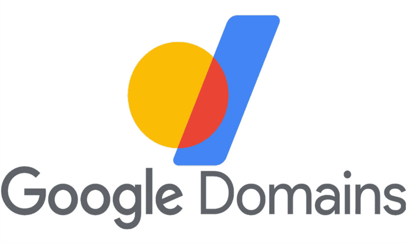
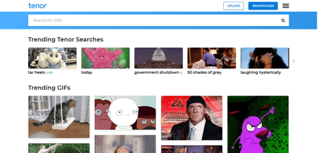

Google killed the Tenor gif API today, and I wish I could say that I was surprised.

If you’ve built anything even remotely social (chat apps, dashboards, internal tools) you’ve probably leaned on Tenor at some point. It was simple, reliable, and did exactly what it needed to do: give you a clean, searchable gif experience without forcing you into some bloated ecosystem. That’s rare. Even if you've never touched an IDE, chances are you used Tenor when picking out the perfect gif to send to someone. It was Twitter's gif selector, it was the main gif selector in Discord, and it was even built into the **keyboard app** on many phones.

And as of this morning, June 30th, 2026, it’s gone. Not deprecated with a thoughtful migration path. Not evolved into something better. Just… gone as a viable option.

And the frustrating part isn’t just Tenor being unplugged; it’s the pattern once again rearing its head.

Google has a long, well-documented habit of killing products that people actually use. Not experimental side projects, but real tools embedded in workflows. I'm sure many people will remember how "Gmail" was in an open Beta test for an absurdly long time, but there have been many other projects (both Google-created and projects acquired along the way) that Google has sunset. Two that strike partiucularly close to my heart:

**Google Domains:** one of the cleanest, least annoying domain registrars out there. No upsell circus, no dark patterns—just buy a domain and move on with your life. Gone.

**Google Podcasts:** easily the most straightforward podcast app. No algorithmic nonsense, no clutter, just a chronological feed of what you subscribed to. Also gone.

**And now Tenor:** a foundational piece of internet culture quietly pulled out from under developers.

As someone deep in open source development and maintainability, this kind of thing hits differently. You build systems assuming some level of stability from major providers, especially when the product is widely adopted and integrated. But with Google, there’s always this background risk that anything not directly tied to ad revenue can disappear overnight.

At the risk of sounding like someone who has spent WAY too much on a homelab (I have, but that's not the point), I have to point out that if you don’t host it, you don’t control it. The public option will usually be fine—until it isn’t. And when it isn’t, you don’t want to be scrambling to replace a critical dependency overnight.

There's a saying when it comes to VPNs: *You shouldn't have a setup where you can't easily swap your VPN provider.* I think that this same mentality need to be applied to any hosted service.

Because at some point, one way or another, the thing you depend on might end up joining Google Domains, Google Podcasts, and now Tenor.
